# 🧴 GlowGraph — Skincare Routine Compatibility Checker

A graph-powered web app that tells you whether the skincare products you use actually work well together — built on **CognoDB**, a managed graph database, using Spring Boot and Spring Data Neo4j.

Built as a self-directed portfolio project demonstrating graph data modeling, engineering architecture, and full-stack development with a real graph database.

---

## 📖 Overview

Most people layer 4-6 skincare products daily with no idea whether the ingredients inside them are fighting each other. Retinol and Vitamin C, for instance, are commonly used together despite conflicting — reducing effectiveness or irritating skin.

GlowGraph lets a user:
*   🧪 **Browse a product catalog** and see what's inside each product.
*   ⚠️ **Build a routine** and instantly see ingredient-level conflicts, with the reason explained.
*   ✅ **See beneficial ingredient pairings** already present in their routine.
*   💡 **Get safe product recommendations** for a specific skin concern.
*   📊 **Explore which ingredients cause the most conflicts** across the whole catalog.
*   🕸️ **Uncover indirect risks** — ingredients that don't conflict directly but both conflict with a shared third ingredient.

---

## 🤔 Why a Graph Database?

Ingredient relationships are many-to-many and self-referential — ingredients relate to other ingredients, not to a parent table. Answering *"does anything in my 5-product routine conflict with anything else in it"* in a relational database means repeated self-joins on a bridge table, growing messier and slower as the routine grows.

In Cypher, it's a single readable pattern that walks the relationships directly:

```cypher
(Product)-[:CONTAINS]->(Ingredient)-[:CONFLICTS_WITH]->(Ingredient)<-[:CONTAINS]-(Product)
```

The traversal is the query. Features like indirect risk detection (ingredients that conflict through a shared third ingredient) require variable-length path queries — something a relational schema handles awkwardly at best. This is the core argument for choosing a graph database for this problem.

---

## 🏗️ Architecture

Every request travels down through the layers to CognoDB and the response travels back up, transformed at each step:

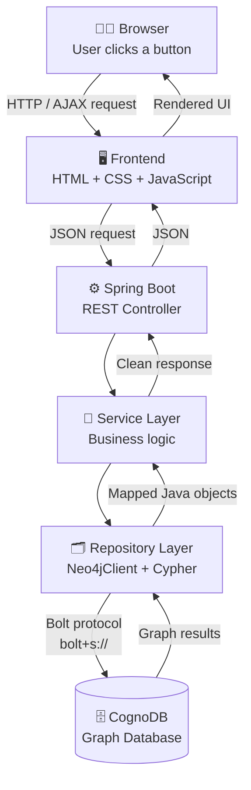

<table>
  <thead>
    <tr>
      <th align="left">Layer</th>
      <th align="left">Technology</th>
      <th align="left">Role</th>
    </tr>
  </thead>
  <tbody>
    <tr>
      <td><b>Database</b></td>
      <td>CognoDB (managed graph DB, openCypher over Bolt)</td>
      <td>Stores all product, ingredient, and relationship data as a graph</td>
    </tr>
    <tr>
      <td><b>Driver</b></td>
      <td>Official Neo4j Java Driver (Bolt 5.x, bolt+s://)</td>
      <td>Secure connection between the app and CognoDB</td>
    </tr>
    <tr>
      <td><b>Backend</b></td>
      <td>Spring Boot</td>
      <td>REST API layer — controllers, services, configuration</td>
    </tr>
    <tr>
      <td><b>Data Access</b></td>
      <td>Spring Data Neo4j Neo4jClient</td>
      <td>Runs explicit, parameterized Cypher queries directly — chosen over repository auto-mapping for full control and reliable compatibility with CognoDB</td>
    </tr>
    <tr>
      <td><b>Query Language</b></td>
      <td>Cypher (openCypher)</td>
      <td>Every core query — conflict checks, recommendations, ranking, indirect risk</td>
    </tr>
    <tr>
      <td><b>Frontend</b></td>
      <td>HTML / CSS / JavaScript (AJAX)</td>
      <td>Dynamic, no-reload UI</td>
    </tr>
    <tr>
      <td><b>Secrets</b></td>
      <td>Environment variables</td>
      <td>CognoDB URI & password, never committed</td>
    </tr>
    <tr>
      <td><b>Hosting</b></td>
      <td>Render (free tier)</td>
      <td>Hosts the live demo</td>
    </tr>
  </tbody>
</table>

---

## 🧬 Data Model

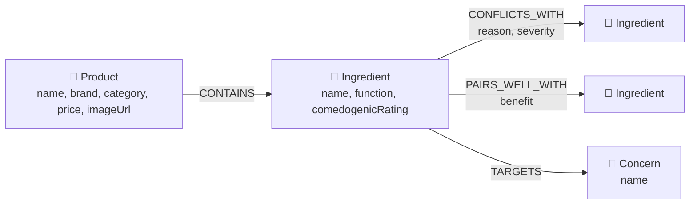

*   **Nodes**: `Product`, `Ingredient`, `Concern`
*   **Relationships**: `CONTAINS`, `CONFLICTS_WITH` (with `reason` + `severity`), `PAIRS_WELL_WITH` (with `benefit`), `TARGETS`

---

## ✨ Features — What Happens Behind Every Click

### 💡 1. Recommendations

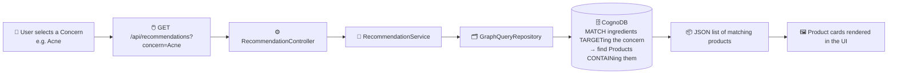

### ⚠️ 2. Routine Conflict Checker — the core feature

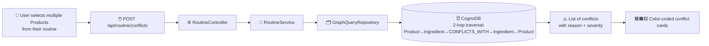

### ⚖️ 3. Ingredient Comparison

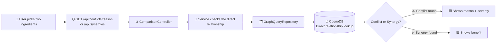

### 📊 4. Ingredient Intelligence (Most Problematic Ingredients)

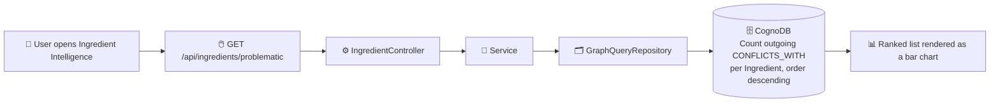

### 🕸️ 5. Indirect Risk Analysis

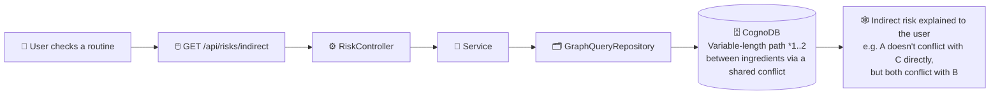

---

## 🔌 API Endpoints

<table>
  <thead>
    <tr>
      <th align="left">Method</th>
      <th align="left">Endpoint</th>
      <th align="left">Purpose</th>
    </tr>
  </thead>
  <tbody>
    <tr>
      <td><b>GET</b></td>
      <td><code>/api/recommendations?concern={name}</code></td>
      <td>Safe products for a stated skin concern</td>
    </tr>
    <tr>
      <td><b>POST</b></td>
      <td><code>/api/routine/conflicts</code></td>
      <td>Conflict check across a full routine (multi-hop)</td>
    </tr>
    <tr>
      <td><b>GET</b></td>
      <td><code>/api/conflicts/reason?a={ingredient}&b={ingredient}</code></td>
      <td>Why two ingredients conflict</td>
    </tr>
    <tr>
      <td><b>GET</b></td>
      <td><code>/api/synergies?a={ingredient}&b={ingredient}</code></td>
      <td>Whether two ingredients pair well</td>
    </tr>
    <tr>
      <td><b>GET</b></td>
      <td><code>/api/ingredients/problematic</code></td>
      <td>Ranked list of most-conflicting ingredients</td>
    </tr>
    <tr>
      <td><b>GET</b></td>
      <td><code>/api/risks/indirect</code></td>
      <td>Indirect (2-hop) conflict risks in a routine</td>
    </tr>
  </tbody>
</table>

*All queries are parameterized through the official Neo4j driver — no string-concatenated Cypher anywhere in the codebase.*

---

## 🧪 Key Cypher Queries Explained

### Multi-hop conflict check across a routine:

```cypher
MATCH (p1:Product)-[:CONTAINS]->(i1:Ingredient)-[c:CONFLICTS_WITH]->(i2:Ingredient)<-[:CONTAINS]-(p2:Product)
WHERE p1.name IN $products 
  AND p2.name IN $products 
  AND p1.name < p2.name
RETURN p1.name, i1.name, i2.name, p2.name, c.reason, c.severity
```

*This is the query a relational database would find awkward — it needs repeated self-joins on a bridge table in SQL, growing worse as the routine grows. In Cypher, it's a direct traversal.*

### Most problematic ingredients (graph-native ranking):

```cypher
MATCH (i:Ingredient)-[:CONFLICTS_WITH]->()
RETURN i.name, count(*) AS conflictCount
ORDER BY conflictCount DESC
```

### Indirect risk (variable-length path):

```cypher
MATCH (i1:Ingredient)-[:CONFLICTS_WITH*1..2]-(i2:Ingredient)
WHERE i1.name <> i2.name
RETURN i1.name, i2.name
```

---

## 🛠️ Tech Stack
*   **Database**: CognoDB (managed graph DB, openCypher/Bolt)
*   **Backend**: Spring Boot, Spring Data Neo4j (Neo4jClient)
*   **Frontend**: HTML, CSS, JavaScript (AJAX)
*   **Driver**: Official Neo4j Java Driver
*   **Hosting**: Render (free tier)

---

## 🚀 Project Setup & Development Workflow

The project was configured and run successfully using the following flow:

### 1. CognoDB Cloud Instance Provisioning
Provisioned a free (c0) tier graph database instance on console.cognodb.com.
Obtained the secure connection URI (`bolt+s://db-40e15442.databases.cognodb.com`) and driver credentials.

### 2. Configuration & Git Security Setup
Cloned and initialized the repository structure.

Mapped system secrets to environment variables to keep credentials secure in production:
*   `COGNODB_URI`
*   `COGNODB_USERNAME`
*   `COGNODB_PASSWORD`

Segregated credentials locally by creating `src/main/resources/application-local.properties` (which is gitignored to prevent accidental leaks):

```properties
spring.neo4j.uri=bolt+s://db-40e15442.databases.cognodb.com
spring.neo4j.authentication.username=cognodb
spring.neo4j.authentication.password=aa6c02595238b90674c4f2c6f699f2a8
```

### 3. Database Seeding & Data Load
Populated all ingredients, products, conflicts, synergies, and targeted skin concerns into the CognoDB instance by running:

```bash
mvn spring-boot:run -Dspring-boot.run.arguments=seed
```

### 4. Running the Local Application Server
Started the Spring Boot server (serving port `8090`) to host the web interface:

```bash
mvn spring-boot:run
```

Accessed the dashboard locally at http://localhost:8090.

---

## 📸 Project Visual Gallery

### 1. Concern Recommendations (Dashboard)
Displays safe product recommendations matching a selected skin concern (e.g., *Dryness* or *Acne*):

<p align="center">
  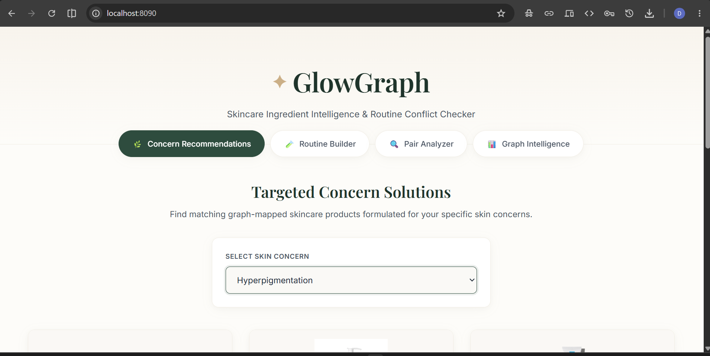
  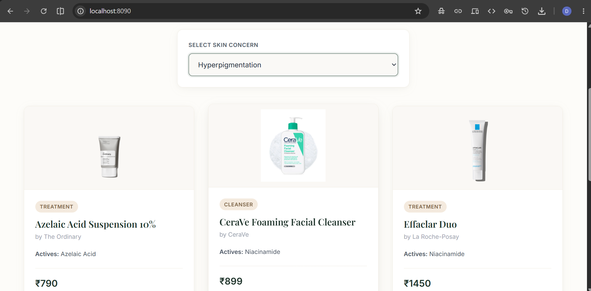
</p>

### 2. Routine Safety Checker
Evaluates routine layering safety, returning color-coded warnings and detailed chemical mismatch reasons:

<p align="center">
  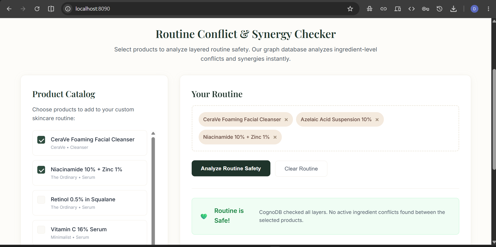
  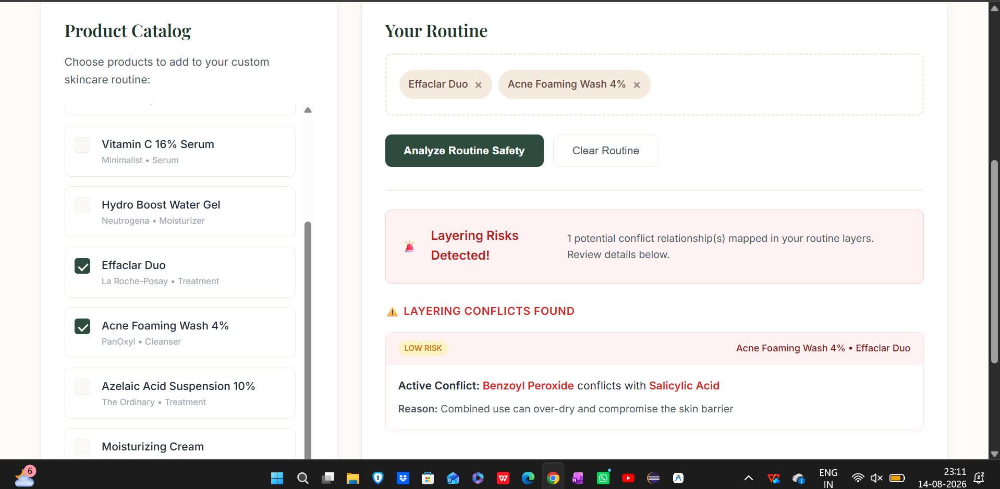
</p>

### 3. Ingredient Pair Analyzer
Enables quick side-by-side compatibility checks between any two active skincare ingredients (showing synergies, conflicts, or neutral statuses):

<p align="center">
  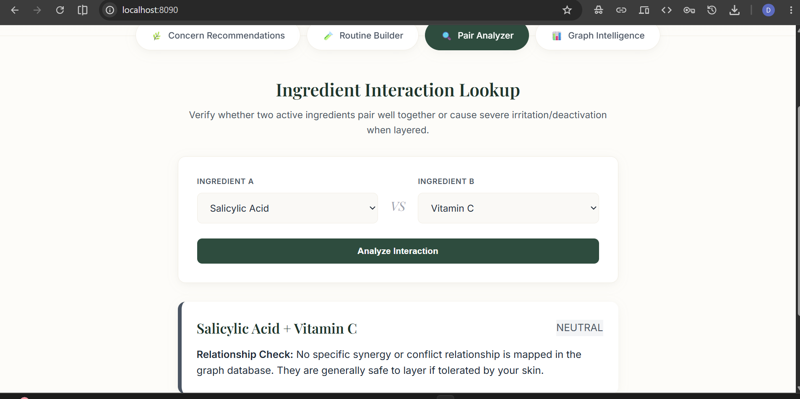
  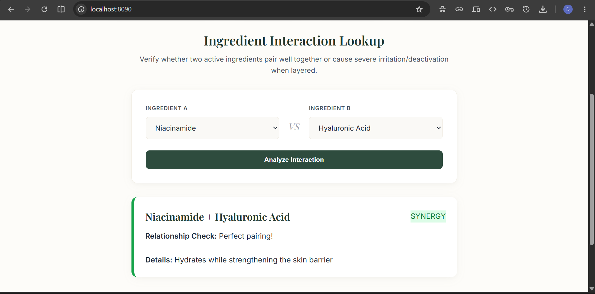
</p>

### 4. Graph Intelligence & Incompatibility Report
Traces multi-hop paths of indirect barrier risk and ranks ingredients globally. Clicking any row triggers a real-time modal identifying conflicting actives and catalog items:

<p align="center">
  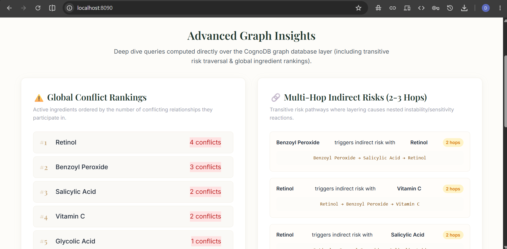
  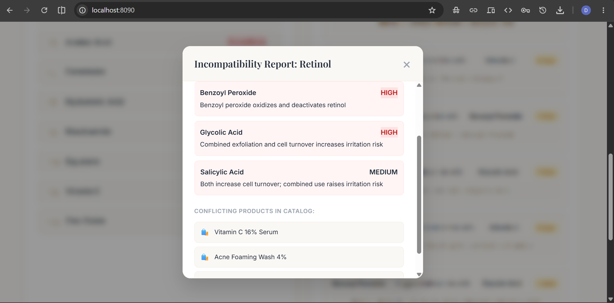
</p>


---

## 🎥 Demo
*   **Live app**: *[Add your Render deployment link here]*
*   **Screen recording**: *[Add your demo video link here]*

---

## 🔮 Future Enhancements
*   User accounts to save routines across sessions.
*   Expand the ingredient catalog beyond the seeded ~30.
*   Severity-weighted overall "routine risk score".
*   Barcode/photo-based product lookup.

---

## 👩‍💻 Author
**D. Rajyalakshmi** — [GitHub](https://github.com/rajyalakshmi-6)

*Built as an individual project exploring graph database integration in Spring Boot.*
